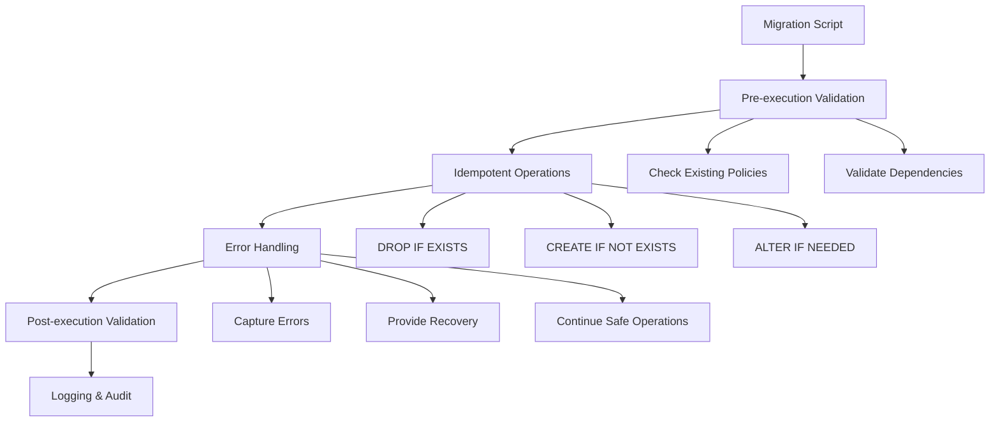

# Design Document

## Overview

This design addresses database policy conflicts that occur when running SQL migration scripts multiple times. The solution implements idempotent database operations using PostgreSQL's conditional DDL statements and proper error handling patterns. The design ensures that migration scripts can be safely executed multiple times without causing errors or data inconsistencies.

## Architecture

The solution follows a layered approach:

1. **Migration Script Layer**: Enhanced SQL scripts with idempotent operations
2. **Validation Layer**: Pre-execution checks for database state
3. **Error Handling Layer**: Comprehensive error capture and recovery
4. **Logging Layer**: Detailed operation tracking and audit trails



## Components and Interfaces

### 1. Idempotent Policy Manager

**Purpose**: Manages PostgreSQL RLS policies with safe creation and updates

**Key Functions**:
- `create_policy_safe(table_name, policy_name, policy_definition)`
- `update_policy_safe(table_name, policy_name, new_definition)`
- `drop_policy_safe(table_name, policy_name)`
- `validate_policy_exists(table_name, policy_name)`

**Implementation Pattern**:
```sql
-- Safe policy creation pattern
DO $$
BEGIN
    -- Check if policy exists
    IF NOT EXISTS (
        SELECT 1 FROM pg_policies 
        WHERE tablename = 'table_name' 
        AND policyname = 'policy_name'
    ) THEN
        -- Create policy only if it doesn't exist
        EXECUTE 'CREATE POLICY "policy_name" ON table_name FOR SELECT USING (condition)';
    ELSE
        -- Log that policy already exists
        RAISE NOTICE 'Policy "%" already exists on table "%"', 'policy_name', 'table_name';
    END IF;
END $$;
```

### 2. Migration State Validator

**Purpose**: Validates database state before and after migrations

**Key Functions**:
- `validate_table_exists(table_name)`
- `validate_column_exists(table_name, column_name)`
- `validate_policy_consistency(table_name)`
- `generate_state_report()`

**Validation Checks**:
- Table existence and structure
- Column presence and types
- Policy definitions and consistency
- Index availability
- Function signatures

### 3. Error Handler and Recovery System

**Purpose**: Handles migration errors gracefully with recovery options

**Key Functions**:
- `capture_migration_error(error_details)`
- `suggest_recovery_actions(error_type)`
- `rollback_partial_migration(checkpoint)`
- `generate_manual_fix_script(error_context)`

**Error Categories**:
- **Policy Conflicts**: Existing policies with same names
- **Dependency Errors**: Missing tables or columns
- **Permission Issues**: Insufficient privileges
- **Syntax Errors**: Invalid SQL in migration scripts

### 4. Migration Logger and Auditor

**Purpose**: Comprehensive logging of all migration operations

**Key Functions**:
- `log_migration_start(script_name, timestamp)`
- `log_operation_result(operation, success, details)`
- `log_migration_complete(summary)`
- `generate_audit_report(time_range)`

## Data Models

### Migration Execution Log

```sql
CREATE TABLE IF NOT EXISTS migration_execution_log (
    id BIGSERIAL PRIMARY KEY,
    script_name VARCHAR NOT NULL,
    execution_id UUID DEFAULT gen_random_uuid(),
    started_at TIMESTAMP WITH TIME ZONE DEFAULT NOW(),
    completed_at TIMESTAMP WITH TIME ZONE,
    status VARCHAR NOT NULL DEFAULT 'running', -- running, completed, failed, partial
    operations_attempted INTEGER DEFAULT 0,
    operations_successful INTEGER DEFAULT 0,
    operations_failed INTEGER DEFAULT 0,
    error_details JSONB,
    recovery_actions JSONB,
    created_by VARCHAR DEFAULT current_user
);
```

### Policy State Tracking

```sql
CREATE TABLE IF NOT EXISTS policy_state_tracking (
    id BIGSERIAL PRIMARY KEY,
    table_name VARCHAR NOT NULL,
    policy_name VARCHAR NOT NULL,
    policy_definition TEXT NOT NULL,
    created_at TIMESTAMP WITH TIME ZONE DEFAULT NOW(),
    created_by_migration VARCHAR,
    last_modified_at TIMESTAMP WITH TIME ZONE DEFAULT NOW(),
    is_active BOOLEAN DEFAULT true,
    UNIQUE(table_name, policy_name)
);
```

## Correctness Properties

*A property is a characteristic or behavior that should hold true across all valid executions of a system-essentially, a formal statement about what the system should do. Properties serve as the bridge between human-readable specifications and machine-verifiable correctness guarantees.*

Now I'll analyze the acceptance criteria to determine which ones are testable as properties:

### Converting EARS to Properties

Based on the prework analysis, I'll now convert the testable acceptance criteria into correctness properties:

**Property 1: Migration script idempotency**
*For any* migration script and database state, running the script multiple times should always succeed without errors
**Validates: Requirements 1.1, 1.3**

**Property 2: Policy conflict handling**
*For any* existing policy, attempting to create the same policy should result in warnings rather than failures
**Validates: Requirements 1.2, 1.5**

**Property 3: Policy update safety**
*For any* existing policy, updating its definition should result in the new definition being active without affecting other policies
**Validates: Requirements 2.1, 2.3**

**Property 4: Error message clarity**
*For any* policy update failure, the system should provide clear error messages and rollback instructions
**Validates: Requirements 2.5**

**Property 5: Migration validation completeness**
*For any* migration execution, the system should validate all dependencies and existing objects before proceeding
**Validates: Requirements 3.1, 3.4**

**Property 6: Conflict information detail**
*For any* detected conflict, the system should provide detailed information about existing objects and repair options
**Validates: Requirements 3.2, 3.3**

**Property 7: Validation failure guidance**
*For any* validation failure, the system should provide clear guidance for manual resolution
**Validates: Requirements 3.5**

**Property 8: Error logging completeness**
*For any* SQL error during migration, the system should capture and log detailed error information
**Validates: Requirements 4.1**

**Property 9: Partial failure resilience**
*For any* migration with mixed success/failure operations, the system should continue with successful operations and provide rollback instructions for failures
**Validates: Requirements 4.2, 4.3**

**Property 10: Error classification accuracy**
*For any* error during migration, the system should correctly classify it as fatal or warning
**Validates: Requirements 4.4**

**Property 11: Recovery guidance provision**
*For any* scenario requiring recovery, the system should provide step-by-step remediation guidance
**Validates: Requirements 4.5**

**Property 12: Production safety confirmation**
*For any* risky operation in production environment, the system should require explicit confirmation
**Validates: Requirements 5.5**

**Property 13: Policy documentation completeness**
*For any* created policy, the system should include comments explaining its purpose
**Validates: Requirements 6.1**

**Property 14: Change tracking consistency**
*For any* policy modification, the system should maintain a complete changelog entry
**Validates: Requirements 6.2**

**Property 15: Policy inspection availability**
*For any* active policy, the system should provide easy ways to list and inspect it
**Validates: Requirements 6.3**

**Property 16: Complex policy documentation**
*For any* complex policy, the system should include examples of intended behavior
**Validates: Requirements 6.4**

**Property 17: Environment adaptation**
*For any* environment configuration, the migration script should adapt appropriately
**Validates: Requirements 7.1**

**Property 18: Database version compatibility**
*For any* supported database version, the migration script should use compatible SQL syntax
**Validates: Requirements 7.2**

**Property 19: Permission handling graceful**
*For any* permission configuration, the migration script should handle authorization differences gracefully
**Validates: Requirements 7.3**

**Property 20: Environment-specific validation**
*For any* environment, the system should provide appropriate validation and testing capabilities
**Validates: Requirements 7.4**

**Property 21: Environment-specific troubleshooting**
*For any* migration failure in any environment, the system should provide environment-specific troubleshooting guidance
**Validates: Requirements 7.5**

**Property 22: Automatic conflict resolution**
*For any* duplicate policy conflict, the system should automatically choose the most recent definition
**Validates: Requirements 8.1**

**Property 23: Automatic renaming strategy**
*For any* policy name conflict, the system should provide automatic renaming strategies
**Validates: Requirements 8.2**

**Property 24: Automatic reconciliation attempt**
*For any* table structure difference, the system should attempt automatic reconciliation
**Validates: Requirements 8.3**

**Property 25: Conflict pattern recognition**
*For any* common conflict pattern, the system should recognize and resolve it using the pattern library
**Validates: Requirements 8.4**

**Property 26: Manual resolution guidance**
*For any* conflict that cannot be automatically resolved, the system should provide guided manual resolution steps
**Validates: Requirements 8.5**

## Error Handling

The system implements comprehensive error handling across multiple layers:

### 1. SQL-Level Error Handling

```sql
-- Example error handling pattern
DO $$
DECLARE
    error_context TEXT;
    operation_result BOOLEAN := FALSE;
BEGIN
    BEGIN
        -- Attempt the operation
        CREATE POLICY "example_policy" ON example_table FOR SELECT USING (condition);
        operation_result := TRUE;
        RAISE NOTICE 'Policy created successfully';
    EXCEPTION 
        WHEN duplicate_object THEN
            RAISE NOTICE 'Policy already exists, skipping creation';
            operation_result := TRUE;
        WHEN insufficient_privilege THEN
            error_context := 'Insufficient privileges to create policy';
            RAISE WARNING 'Error: %', error_context;
        WHEN OTHERS THEN
            error_context := format('Unexpected error: %s (SQLSTATE: %s)', SQLERRM, SQLSTATE);
            RAISE WARNING 'Error: %', error_context;
    END;
    
    -- Log the operation result
    INSERT INTO migration_execution_log (operation, success, details)
    VALUES ('create_policy_example', operation_result, error_context);
END $$;
```

### 2. Migration-Level Error Recovery

- **Checkpoint System**: Create restore points before major operations
- **Rollback Scripts**: Generate automatic rollback instructions
- **Partial Success Handling**: Continue with successful operations when possible
- **Manual Intervention Guidance**: Provide clear steps for manual fixes

### 3. Environment-Specific Error Handling

- **Development**: Verbose logging and detailed error messages
- **Staging**: Balanced logging with recovery suggestions
- **Production**: Minimal logging with security-conscious error messages

## Testing Strategy

The testing approach combines unit tests for specific scenarios with property-based tests for comprehensive coverage:

### Unit Testing Focus

- **Specific Error Scenarios**: Test known conflict patterns and edge cases
- **Environment Simulation**: Test behavior in different database configurations
- **Recovery Procedures**: Test rollback and manual fix generation
- **Integration Points**: Test interaction with existing database objects

### Property-Based Testing Focus

- **Idempotency Verification**: Test that operations can be repeated safely
- **Error Classification**: Test that all errors are properly categorized
- **Conflict Resolution**: Test automatic resolution across various conflict types
- **Documentation Generation**: Test that all operations generate proper documentation

### Testing Configuration

- **Minimum 100 iterations** per property test to ensure comprehensive input coverage
- **Database State Variations**: Test with different initial database states
- **Permission Variations**: Test with different user privilege levels
- **Version Compatibility**: Test across supported PostgreSQL versions

Each property test will be tagged with:
**Feature: database-policy-conflicts, Property {number}: {property_text}**

### Test Database Setup

```sql
-- Test database initialization
CREATE SCHEMA IF NOT EXISTS migration_test;
SET search_path TO migration_test;

-- Create test tables and policies for testing
CREATE TABLE IF NOT EXISTS test_table (
    id SERIAL PRIMARY KEY,
    user_id INTEGER,
    data TEXT
);

-- Enable RLS for testing
ALTER TABLE test_table ENABLE ROW LEVEL SECURITY;
```

The testing strategy ensures that all migration operations are thoroughly validated before deployment, with particular focus on the idempotent behavior that prevents the original policy conflict errors.