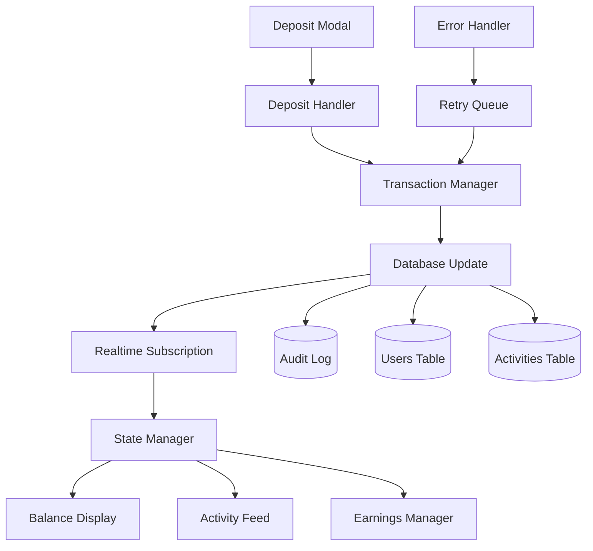

# Design Document: Deposit Balance Sync Fixes

## Overview

This design addresses critical issues with deposit balance synchronization and activity display in the TON mining application. The current implementation has gaps in real-time data updates, causing user confusion when deposits don't immediately reflect in the UI. This solution provides immediate balance updates, comprehensive activity tracking, and robust error handling to ensure users always see accurate, up-to-date information.

## Architecture

The deposit balance sync system follows a reactive architecture with real-time subscriptions and optimistic updates:



### Key Components

1. **Transaction Manager**: Orchestrates the complete deposit flow from wallet transaction to UI updates
2. **State Manager**: Centralized state management with real-time synchronization
3. **Realtime Subscription**: Supabase real-time subscriptions for instant data updates
4. **Error Handler**: Comprehensive error handling with retry logic and user feedback
5. **Activity Feed Manager**: Manages activity display with real-time updates and proper formatting

## Components and Interfaces

### Transaction Manager Interface

```typescript
interface TransactionManager {
  processDeposit(amount: number): Promise<DepositResult>;
  confirmTransaction(txHash: string, depositId: number): Promise<void>;
  updateUserBalance(userId: number, amount: number): Promise<UserData>;
  handleDepositFailure(depositId: number, error: Error): Promise<void>;
}

interface DepositResult {
  success: boolean;
  depositId?: number;
  txHash?: string;
  error?: string;
  newBalance?: number;
}
```

### State Manager Interface

```typescript
interface StateManager {
  subscribeToUserUpdates(userId: number): void;
  subscribeToActivities(userId: number): void;
  updateBalance(newBalance: number): void;
  addActivity(activity: Activity): void;
  refreshUserData(): Promise<void>;
  handleRealtimeUpdate(payload: RealtimePayload): void;
}

interface RealtimePayload {
  eventType: 'INSERT' | 'UPDATE' | 'DELETE';
  new?: any;
  old?: any;
  table: string;
}
```

### Activity Feed Manager Interface

```typescript
interface ActivityFeedManager {
  loadActivities(userId: number, limit?: number): Promise<Activity[]>;
  formatActivity(activity: Activity): FormattedActivity;
  subscribeToNewActivities(userId: number): void;
  handleActivityUpdate(activity: Activity): void;
}

interface FormattedActivity {
  id: string;
  type: ActivityType;
  amount: string;
  formattedAmount: string;
  timestamp: string;
  relativeTime: string;
  status: string;
  icon: React.ReactNode;
  color: string;
}
```

## Data Models

### Enhanced Deposit Flow Model

```typescript
interface DepositFlow {
  id: number;
  user_id: number;
  amount: number;
  amount_nano: string;
  status: 'pending' | 'confirmed' | 'failed';
  tx_hash?: string;
  created_at: string;
  confirmed_at?: string;
  error_message?: string;
  retry_count: number;
}
```

### User Balance State Model

```typescript
interface UserBalanceState {
  userId: number;
  balance: number;
  previousBalance: number;
  lastUpdated: string;
  isLoading: boolean;
  error?: string;
  pendingDeposits: number[];
}
```

### Activity State Model

```typescript
interface ActivityState {
  activities: Activity[];
  isLoading: boolean;
  error?: string;
  hasMore: boolean;
  lastFetched: string;
}
```

## Correctness Properties

*A property is a characteristic or behavior that should hold true across all valid executions of a system-essentially, a formal statement about what the system should do. Properties serve as the bridge between human-readable specifications and machine-verifiable correctness guarantees.*

### Property 1: Balance Update Timing
*For any* confirmed deposit transaction, the balance display should update within 5 seconds
**Validates: Requirements 1.1**

### Property 2: Database Success Triggers Refresh
*For any* successful deposit database function completion, the user's balance data should be refreshed
**Validates: Requirements 1.2**

### Property 3: Automatic UI Updates
*For any* database balance update, the balance display should reflect the new amount without requiring page refresh
**Validates: Requirements 1.3**

### Property 4: Sequential Deposit Accumulation
*For any* sequence of multiple deposits, the balance display should show the correct cumulative total
**Validates: Requirements 1.4**

### Property 5: Balance Refresh Retry
*For any* failed balance display update, the system should retry the balance refresh operation
**Validates: Requirements 1.5**

### Property 6: Immediate Activity Display
*For any* completed deposit, the activity feed should display the deposit entry immediately
**Validates: Requirements 2.1**

### Property 7: Claim Activity Logging
*For any* earnings claim operation, the activity feed should show the corresponding claim transaction
**Validates: Requirements 2.2**

### Property 8: Chronological Activity Ordering
*For any* set of activities fetched from the database, the activity feed should display them in chronological order
**Validates: Requirements 2.3**

### Property 9: Real-time Activity Updates
*For any* new activity occurrence, the activity feed should update in real-time without user action
**Validates: Requirements 2.4**

### Property 10: Activity Feed Display Requirements
*For any* activity feed display, it should show at least the 10 most recent activities with proper formatting
**Validates: Requirements 2.5**

### Property 11: Database Change Notifications
*For any* deposit data change in the database, all relevant UI components should be notified
**Validates: Requirements 3.1**

### Property 12: Balance Update Propagation
*For any* user balance update, all balance display components should receive the update
**Validates: Requirements 3.2**

### Property 13: Activity Database Sync
*For any* activity added to the database, the activity feed should update in real-time
**Validates: Requirements 3.3**

### Property 14: Subscription Processing Timing
*For any* database subscription update, the system should process it within 2 seconds
**Validates: Requirements 3.4**

### Property 15: Real-time Fallback Mechanism
*For any* failed real-time update, the system should fall back to periodic polling
**Validates: Requirements 3.5**

### Property 16: Exponential Backoff Retry
*For any* failed balance refresh, the system should retry with exponential backoff timing
**Validates: Requirements 4.1**

### Property 17: Activity Loading Error UI
*For any* activity loading failure, the activity feed should show a retry option to the user
**Validates: Requirements 4.2**

### Property 18: Offline Update Queuing
*For any* database connection loss, the system should queue updates for later synchronization
**Validates: Requirements 4.3**

### Property 19: Inconsistency Error Logging
*For any* detected data inconsistency, the system should log detailed error information
**Validates: Requirements 4.4**

### Property 20: Critical Error User Alerts
*For any* critical error occurrence, the system should alert the user with clear error messages
**Validates: Requirements 4.5**

### Property 21: Processing Loading Indicators
*For any* deposit processing operation, the balance display should show loading indicators
**Validates: Requirements 5.1**

### Property 22: Activity Loading Placeholders
*For any* activity loading operation, the activity feed should display skeleton placeholders
**Validates: Requirements 5.2**

### Property 23: Error Feedback Clarity
*For any* error occurrence, the system should provide clear feedback about what went wrong
**Validates: Requirements 5.4**

### Property 24: Data Freshness Guarantee
*For any* balance display, it should never show stale or incorrect data to the user
**Validates: Requirements 5.5**

### Property 25: Balance Validation Against Database
*For any* balance update, the system should validate that the new balance matches database records
**Validates: Requirements 6.1**

### Property 26: Activity Data Integrity
*For any* displayed activity, the amounts and timestamps should be verified as correct
**Validates: Requirements 6.2**

### Property 27: Discrepancy Flagging
*For any* detected discrepancy, the system should flag it for manual review
**Validates: Requirements 6.3**

### Property 28: Audit Log Completeness
*For any* balance change, the system should maintain audit logs with source information
**Validates: Requirements 6.4**

### Property 29: Activity Deduplication
*For any* activity feed display, duplicate entries should be prevented from showing to users
**Validates: Requirements 6.5**

## Error Handling

### Error Categories and Recovery Strategies

1. **Transaction Failures**
   - Wallet transaction rejected or failed
   - Network timeout during transaction
   - Insufficient funds or gas

2. **Database Synchronization Errors**
   - Connection timeouts
   - Query failures
   - Constraint violations

3. **Real-time Subscription Failures**
   - WebSocket connection drops
   - Subscription authentication failures
   - Message parsing errors

4. **UI State Inconsistencies**
   - Stale data display
   - Missing activity entries
   - Incorrect balance calculations

### Recovery Mechanisms

```typescript
interface ErrorRecoveryManager {
  handleTransactionError(error: TransactionError): Promise<RecoveryAction>;
  handleDatabaseError(error: DatabaseError): Promise<void>;
  handleSubscriptionError(error: SubscriptionError): void;
  validateDataConsistency(): Promise<ValidationResult>;
}

interface RecoveryAction {
  type: 'retry' | 'fallback' | 'alert' | 'ignore';
  delay?: number;
  maxRetries?: number;
  fallbackAction?: () => Promise<void>;
}
```

## Testing Strategy

### Unit Testing Approach
- Test individual components with mocked dependencies
- Focus on error conditions and edge cases
- Validate state transitions and data transformations
- Test retry logic and timing mechanisms

### Property-Based Testing Configuration
- Use fast-check library for TypeScript property testing
- Minimum 100 iterations per property test
- Generate realistic deposit amounts and timing scenarios
- Test concurrent operations and race conditions

### Integration Testing
- Test complete deposit flows end-to-end
- Simulate network failures and recovery
- Test real-time subscription behavior
- Validate cross-component data consistency

### Performance Testing
- Measure UI update latency after deposits
- Test with high-frequency activity updates
- Validate memory usage during long sessions
- Test subscription scalability with multiple users

The testing strategy ensures comprehensive coverage of both functional correctness and performance requirements, with property-based tests providing confidence in the system's behavior across a wide range of deposit scenarios and error conditions.