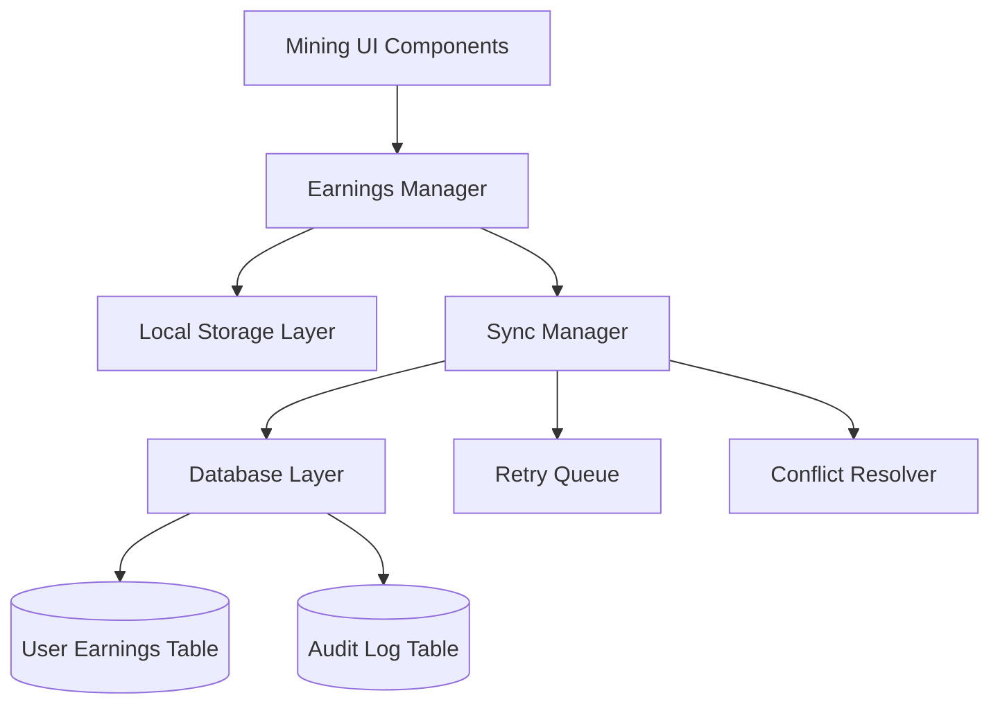

# Design Document: Mining Data Persistence Fixes

## Overview

This design addresses critical issues in the TON mining application's data persistence layer. The current implementation suffers from database schema mismatches, unreliable synchronization, and poor error handling that leads to user data loss. This solution provides a robust, fault-tolerant mining data persistence system with proper offline support and data integrity guarantees.

## Architecture

The mining data persistence system follows a layered architecture with clear separation of concerns:



### Key Components

1. **Earnings Manager**: Central coordinator for all earnings-related operations
2. **Local Storage Layer**: Manages browser-based temporary storage with user isolation
3. **Sync Manager**: Handles database synchronization with retry logic and conflict resolution
4. **Database Layer**: Provides transactional access to persistent storage
5. **Retry Queue**: Manages failed operations for later retry with exponential backoff
6. **Conflict Resolver**: Handles data conflicts between local and server state

## Components and Interfaces

### Earnings Manager Interface

```typescript
interface EarningsManager {
  initializeUser(userId: number): Promise<EarningsState>;
  updateEarnings(userId: number, amount: number): Promise<void>;
  syncToDatabase(userId: number, force?: boolean): Promise<SyncResult>;
  handleOfflineMode(userId: number): void;
  reconcileData(userId: number): Promise<ReconciliationResult>;
}

interface EarningsState {
  userId: number;
  currentEarnings: number;
  baseEarningRate: number;
  lastUpdate: number;
  startDate: number;
  isActive: boolean;
  syncStatus: 'synced' | 'pending' | 'failed';
}
```

### Sync Manager Interface

```typescript
interface SyncManager {
  queueSync(operation: SyncOperation): void;
  processQueue(): Promise<void>;
  retryFailedOperations(): Promise<void>;
  validateData(data: EarningsData): ValidationResult;
}

interface SyncOperation {
  id: string;
  userId: number;
  type: 'earnings_update' | 'state_sync' | 'reconciliation';
  data: any;
  timestamp: number;
  retryCount: number;
  maxRetries: number;
}
```

### Database Schema Updates

```sql
-- Add missing fields to user_earnings table
ALTER TABLE user_earnings 
ADD COLUMN IF NOT EXISTS start_date TIMESTAMP WITH TIME ZONE DEFAULT CURRENT_TIMESTAMP,
ADD COLUMN IF NOT EXISTS base_earning_rate NUMERIC(18,8) DEFAULT 0,
ADD COLUMN IF NOT EXISTS sync_status VARCHAR(20) DEFAULT 'synced',
ADD COLUMN IF NOT EXISTS last_sync_attempt TIMESTAMP WITH TIME ZONE,
ADD COLUMN IF NOT EXISTS retry_count INTEGER DEFAULT 0;

-- Create indexes for performance
CREATE INDEX IF NOT EXISTS idx_user_earnings_user_sync 
ON user_earnings(user_id, sync_status, last_update);

CREATE INDEX IF NOT EXISTS idx_user_earnings_retry 
ON user_earnings(retry_count, last_sync_attempt) 
WHERE sync_status = 'failed';
```

## Data Models

### Enhanced User Earnings Model

```typescript
interface UserEarnings {
  id: number;
  user_id: number;
  current_earnings: number;
  earning_rate: number;
  base_earning_rate: number;
  last_update: string;
  start_date: string;
  created_at: string;
  updated_at: string;
  total_earned: number;
  sync_status: 'synced' | 'pending' | 'failed';
  last_sync_attempt?: string;
  retry_count: number;
}
```

### Local Storage Structure

```typescript
interface LocalEarningsData {
  [userId: string]: {
    state: EarningsState;
    pendingOperations: SyncOperation[];
    lastCleanup: number;
    version: number;
  };
}
```

### Audit Log Model

```typescript
interface EarningsAuditLog {
  id: number;
  user_id: number;
  operation_type: string;
  old_value?: number;
  new_value?: number;
  timestamp: string;
  source: 'local' | 'sync' | 'reconciliation';
  metadata: Record<string, any>;
}
```

## Correctness Properties

*A property is a characteristic or behavior that should hold true across all valid executions of a system-essentially, a formal statement about what the system should do. Properties serve as the bridge between human-readable specifications and machine-verifiable correctness guarantees.*

### Property 1: Database Schema Consistency
*For any* mining session initialization, the database operations should complete successfully without field-related errors
**Validates: Requirements 1.3**

### Property 2: Earnings Sync Timing
*For any* local earnings calculation, the database should be updated within the specified time limit (60 seconds)
**Validates: Requirements 2.1**

### Property 3: Retry Exponential Backoff
*For any* failed database sync operation, retry attempts should follow exponential backoff timing patterns
**Validates: Requirements 2.2**

### Property 4: Data Queuing Under Failure
*For any* series of sync failures, earnings data should be preserved in a queue for later synchronization
**Validates: Requirements 2.3**

### Property 5: Offline Data Reconciliation
*For any* offline period followed by reconnection, local and server earnings data should be properly reconciled without data loss
**Validates: Requirements 2.4**

### Property 6: Network Interruption Resilience
*For any* network interruption during sync operations, no earnings data should be lost
**Validates: Requirements 2.5**

### Property 7: User Data Isolation
*For any* multiple users on the same device, their local storage data should remain completely separate
**Validates: Requirements 3.1, 3.2**

### Property 8: Local Storage Recovery
*For any* corrupted local storage scenario, the system should successfully recover user state from the database
**Validates: Requirements 3.3**

### Property 9: Cache Cleanup Preservation
*For any* cache cleanup operation, the current user's active earnings state should be preserved
**Validates: Requirements 3.4**

### Property 10: Storage Size Management
*For any* local storage usage, automatic cleanup should occur when size limits are approached
**Validates: Requirements 3.5**

### Property 11: Error Logging Completeness
*For any* database operation failure, detailed error information should be logged for debugging
**Validates: Requirements 4.1**

### Property 12: Data Preservation During Errors
*For any* sync error, local earnings data should be preserved until successful synchronization occurs
**Validates: Requirements 4.2**

### Property 13: Offline Earnings Calculation
*For any* offline period, earnings calculations should continue using local state
**Validates: Requirements 4.3**

### Property 14: Automatic Sync Resume
*For any* connection restoration, database synchronization should automatically resume
**Validates: Requirements 4.4**

### Property 15: Corruption Detection and Alerts
*For any* detected data corruption, the system should alert the user and provide recovery options
**Validates: Requirements 4.5**

### Property 16: Earnings Amount Validation
*For any* earnings calculation, the amounts should be positive and within reasonable limits
**Validates: Requirements 5.1**

### Property 17: Timestamp Sequence Validation
*For any* data synchronization, timestamps should be sequential and logically consistent
**Validates: Requirements 5.2**

### Property 18: Inconsistency Detection
*For any* data inconsistency, the system should flag it for manual review
**Validates: Requirements 5.3**

### Property 19: Audit Log Completeness
*For any* earnings calculation or database update, the operation should be logged in the audit trail
**Validates: Requirements 5.5**

### Property 20: UI Update Throttling
*For any* rapid earnings updates, UI refresh should be limited to once per second maximum
**Validates: Requirements 6.1**

### Property 21: Database Operation Batching
*For any* multiple sync operations, they should be batched into single transactions when possible
**Validates: Requirements 6.2**

### Property 22: Storage Serialization Efficiency
*For any* local data storage, serialization should minimize storage size while maintaining data integrity
**Validates: Requirements 6.3**

### Property 23: Resource Cleanup
*For any* expired data or unused resources, proper cleanup should occur automatically
**Validates: Requirements 6.4**

### Property 24: Offline Earnings Continuation
*For any* offline period, earnings calculations should continue using local state without interruption
**Validates: Requirements 7.1**

### Property 25: Offline-to-Online Sync
*For any* transition from offline to online, accumulated offline earnings should be synchronized automatically
**Validates: Requirements 7.2**

### Property 26: Offline Earnings Capping
*For any* extended offline period, earnings should be capped to prevent exploitation
**Validates: Requirements 7.3**

### Property 27: Clock Change Detection
*For any* system clock changes, the mining system should detect and handle them appropriately
**Validates: Requirements 7.4**

### Property 28: Excessive Offline Earnings Verification
*For any* offline earnings that exceed reasonable limits, manual verification should be required
**Validates: Requirements 7.5**

### Property 29: Sync Metrics Logging
*For any* earnings sync operation, timing and success metrics should be logged
**Validates: Requirements 8.1**

### Property 30: Error Context Capture
*For any* system error, detailed context including user state and system conditions should be captured
**Validates: Requirements 8.2**

### Property 31: Discrepancy Reporting
*For any* detected data discrepancy, detailed reports should be created for investigation
**Validates: Requirements 8.3**

### Property 32: KPI Tracking
*For any* system operations, key performance indicators should be tracked and calculated correctly
**Validates: Requirements 8.5**

## Error Handling

### Error Categories and Responses

1. **Database Connection Errors**
   - Automatic retry with exponential backoff
   - Fallback to local-only mode
   - Queue operations for later sync

2. **Data Validation Errors**
   - Log detailed validation failures
   - Reject invalid data with clear error messages
   - Provide data correction suggestions

3. **Sync Conflicts**
   - Use server data as source of truth for conflicts
   - Preserve local changes in conflict log
   - Allow manual conflict resolution for critical discrepancies

4. **Storage Quota Exceeded**
   - Automatic cleanup of old data
   - Compress stored data
   - Alert user if cleanup insufficient

### Recovery Mechanisms

```typescript
interface RecoveryManager {
  detectCorruption(data: any): boolean;
  recoverFromDatabase(userId: number): Promise<EarningsState>;
  resolveConflicts(local: EarningsState, server: UserEarnings): EarningsState;
  validateRecoveredData(data: EarningsState): ValidationResult;
}
```

## Testing Strategy

### Unit Testing Approach
- Test individual components in isolation
- Mock external dependencies (database, network)
- Focus on edge cases and error conditions
- Validate data transformation logic

### Property-Based Testing Configuration
- Use fast-check library for TypeScript property testing
- Minimum 100 iterations per property test
- Generate realistic test data including edge cases
- Test concurrent operations and race conditions

### Integration Testing
- Test complete sync workflows end-to-end
- Simulate network failures and recovery
- Test with multiple concurrent users
- Validate database transaction integrity

### Performance Testing
- Measure sync operation latency
- Test with large datasets
- Validate memory usage patterns
- Test storage cleanup efficiency

The testing strategy ensures comprehensive coverage of both functional correctness and performance requirements, with property-based tests providing confidence in the system's behavior across a wide range of inputs and conditions.