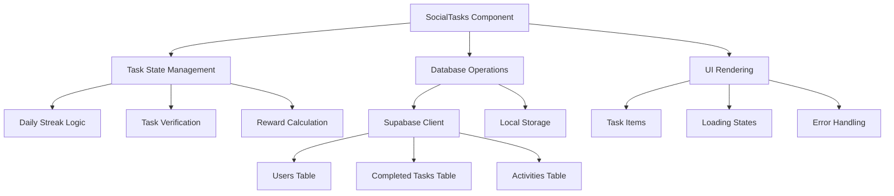

# Design Document: Social Tasks Fixes

## Overview

This design addresses critical issues in the SocialTasks component by implementing database schema updates, TypeScript improvements, and enhanced task verification logic. The solution ensures data consistency, type safety, and reliable task completion tracking while maintaining integration with existing systems.

## Architecture

The fix involves three main architectural layers:

1. **Database Layer**: Schema updates to support missing columns and proper indexing
2. **Component Layer**: TypeScript improvements and logic fixes in the SocialTasks component
3. **Integration Layer**: Enhanced integration with existing reward and activity systems

### Component Architecture



## Components and Interfaces

### Database Schema Updates

**New Columns for Users Table:**
```sql
-- Add missing columns to users table
ALTER TABLE users 
ADD COLUMN IF NOT EXISTS last_daily_claim_date DATE,
ADD COLUMN IF NOT EXISTS daily_streak_count INTEGER DEFAULT 0,
ADD COLUMN IF NOT EXISTS email VARCHAR(255),
ADD COLUMN IF NOT EXISTS is_premium BOOLEAN DEFAULT false;

-- Add indexes for performance
CREATE INDEX IF NOT EXISTS idx_users_last_daily_claim ON users(last_daily_claim_date);
CREATE INDEX IF NOT EXISTS idx_users_daily_streak ON users(daily_streak_count);
CREATE INDEX IF NOT EXISTS idx_users_is_premium ON users(is_premium);
```

**New Columns for Referrals Table:**
```sql
-- Add missing columns to referrals table
ALTER TABLE referrals 
ADD COLUMN IF NOT EXISTS sbt_amount NUMERIC(18,8) DEFAULT 0,
ADD COLUMN IF NOT EXISTS total_sbt_earned NUMERIC(18,8) DEFAULT 0;

-- Add indexes for performance
CREATE INDEX IF NOT EXISTS idx_referrals_sbt_amount ON referrals(sbt_amount);
CREATE INDEX IF NOT EXISTS idx_referrals_total_sbt_earned ON referrals(total_sbt_earned);
```

### TypeScript Interface Improvements

**Enhanced Task Interface:**
```typescript
interface Task {
  id: string;
  title: string;
  description: string;
  reward: number;
  type: TaskType;
  status: TaskStatus;
  action?: string;
  link?: string;
  currentStreak?: number;
  nextPotentialStreak?: number;
}

type TaskType = 
  | 'daily_login' 
  | 'twitter_like' 
  | 'twitter_retweet' 
  | 'twitter_comment' 
  | 'twitter_follow' 
  | 'telegram' 
  | 'telegram_community' 
  | 'welcome_bonus' 
  | 'email_verification' 
  | 'facebook' 
  | 'referral_contest';

type TaskStatus = 'available' | 'completed' | 'claimed';
```

**User Data Interface:**
```typescript
interface UserTaskData {
  last_daily_claim_date: string | null;
  daily_streak_count: number;
  email?: string | null;
  is_premium?: boolean;
}
```

### Task Verification System

**Enhanced Verification Flow:**
1. **Social Media Tasks**: Multi-click verification with database persistence
2. **Daily Login**: Server-side streak calculation with grace periods
3. **Email Verification**: Input validation and database storage
4. **Welcome Bonus**: One-time claim with persistent tracking

**Verification State Management:**
```typescript
interface VerificationState {
  clicks: Record<string, number>;
  requiredClicks: Record<string, number>;
  isVerifying: Record<string, boolean>;
}
```

## Data Models

### Task Completion Tracking

**Database Model:**
- Primary tracking through `completed_tasks` table
- Fallback to localStorage for temporary state
- Real-time sync with Supabase subscriptions

**State Synchronization:**
```typescript
interface TaskSyncState {
  localState: Record<string, boolean>;
  databaseState: Set<string>;
  pendingSync: string[];
}
```

### Daily Streak Calculation

**Streak Logic:**
```typescript
interface StreakCalculation {
  currentStreak: number;
  daysSinceLastClaim: number | null;
  graceAllowance: number;
  newStreak: number;
  rewardAmount: number;
}
```

**Grace Period Rules:**
- Streaks 1-6 days: No grace period
- Streaks 7-20 days: 1 day grace period
- Streaks 21+ days: 2 day grace period

### Reward System Integration

**Reward Processing:**
```typescript
interface RewardTransaction {
  userId: number;
  taskId: string;
  amount: number;
  type: 'smart_claim' | 'daily_streak' | 'social_task';
  metadata?: Record<string, any>;
}
```

## Error Handling

### Database Error Recovery

**Connection Issues:**
- Retry logic with exponential backoff
- Fallback to localStorage for temporary state
- User notification of sync status

**Data Consistency:**
- Validation of database responses
- Conflict resolution for concurrent updates
- Rollback mechanisms for failed transactions

### User Experience Errors

**Task Completion Errors:**
- Clear error messages for failed verifications
- Retry mechanisms for network issues
- Progress preservation during errors

**Validation Errors:**
- Email format validation
- Duplicate claim prevention
- Rate limiting for verification attempts

## Testing Strategy

### Unit Testing Approach

**Component Testing:**
- Mock Supabase client for isolated testing
- Test state management logic
- Verify error handling paths

**Utility Function Testing:**
- Streak calculation edge cases
- Date handling across timezones
- Reward amount calculations

### Integration Testing

**Database Integration:**
- Test schema migrations
- Verify data consistency
- Test concurrent user scenarios

**Real-time Updates:**
- Test Supabase subscription handling
- Verify state synchronization
- Test offline/online transitions

## Correctness Properties

*A property is a characteristic or behavior that should hold true across all valid executions of a system-essentially, a formal statement about what the system should do. Properties serve as the bridge between human-readable specifications and machine-verifiable correctness guarantees.*

### Property Reflection

After analyzing the acceptance criteria, I identified several properties that can be combined or are logically related:

- Properties 3.1, 3.4, and 7.1 all relate to database persistence and can be combined into a comprehensive database integration property
- Properties 3.2 and 6.5 both deal with reward awarding and can be combined
- Properties 4.1, 4.2, and 4.3 all relate to streak calculation and can be unified
- Properties 6.1, 6.2, 6.3, and 6.4 all relate to UI feedback and can be combined into comprehensive UI state properties

### Core Properties

**Property 1: Database Migration Integrity**
*For any* existing user data, when database migrations are applied, the original data should be preserved and new columns should have appropriate default values
**Validates: Requirements 1.5**

**Property 2: Null Safety in Component Operations**
*For any* task property access or streak calculation, when undefined or null values are encountered, the component should handle them gracefully without runtime errors
**Validates: Requirements 2.1, 2.2**

**Property 3: Task Completion and Database Integration**
*For any* completed social media task, the system should record completion in the database, integrate with activity logging, and maintain referential integrity
**Validates: Requirements 3.1, 3.4, 7.1, 7.4**

**Property 4: Reward Calculation and Distribution**
*For any* verified task, the system should award the correct reward amount, update user balances through existing mechanisms, and provide visual feedback
**Validates: Requirements 3.2, 6.5, 7.2**

**Property 5: Duplicate Prevention**
*For any* task or daily claim, when a user attempts multiple completions, only the first valid attempt should succeed and award rewards
**Validates: Requirements 3.3, 4.5**

**Property 6: Daily Streak Calculation**
*For any* user daily claim, the streak should increment correctly, apply appropriate penalties for missed days, and calculate correct reward amounts based on milestones
**Validates: Requirements 4.1, 4.2, 4.3**

**Property 7: Edge Case Handling**
*For any* system operation, when edge cases like timezone differences, server downtime, or network errors occur, the system should handle them gracefully with proper error messages and logging
**Validates: Requirements 4.4, 5.4**

**Property 8: UI State Consistency**
*For any* task state change, the UI should provide immediate feedback, show appropriate loading states, display clear status indicators, and show user-friendly error messages
**Validates: Requirements 6.1, 6.2, 6.3, 6.4**

**Property 9: Authentication and Authorization**
*For any* task operation, the system should respect existing authentication patterns and ensure users can only access and modify their own task data
**Validates: Requirements 7.3**

**Property 10: Real-time Integration**
*For any* task completion or reward update, the system should work correctly with Supabase real-time subscriptions and maintain data consistency across sessions
**Validates: Requirements 7.5**