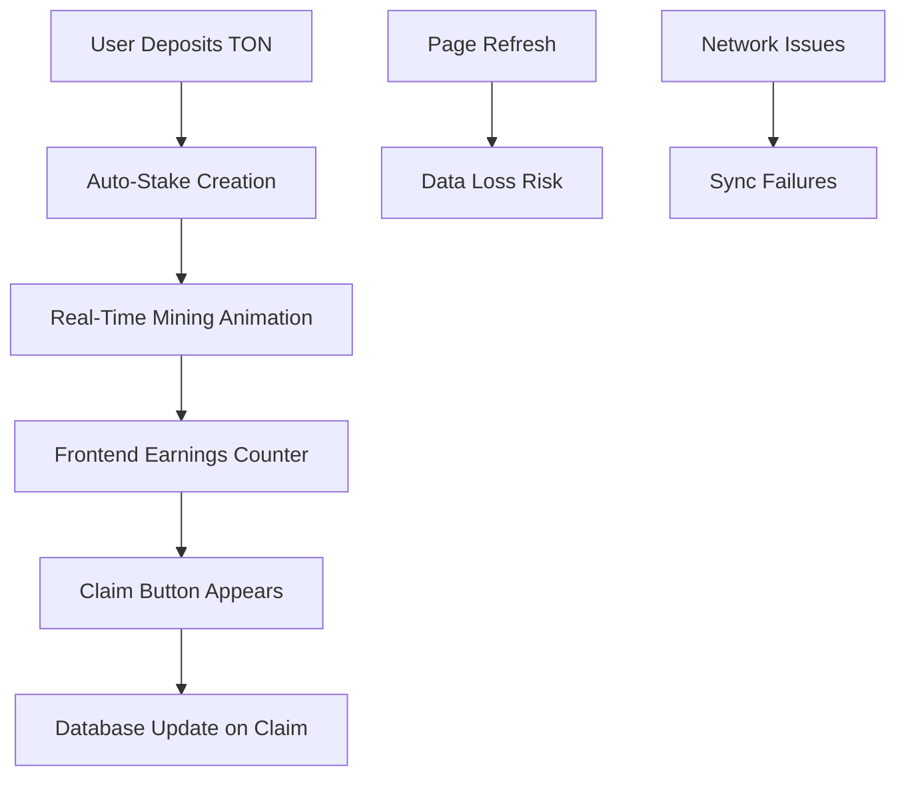
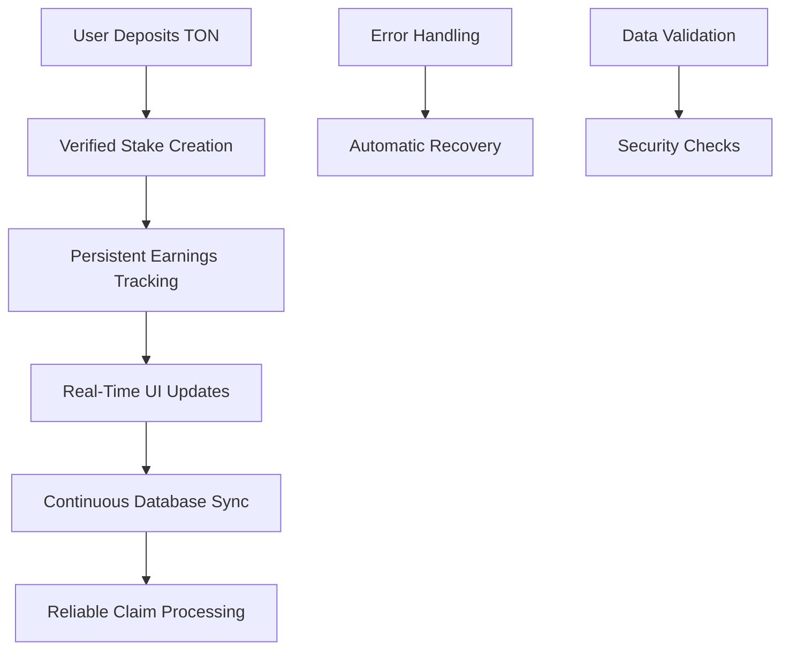

# Design Document: Stake-to-Mine System Analysis & Fixes

## Overview

The current stake-to-mine system has several critical issues that prevent proper data persistence and compromise production safety. This analysis identifies the root causes and provides a comprehensive solution design.

## Architecture

### Current System Flow


### Proposed System Flow


## Components and Interfaces

### 1. Enhanced Mining Screen Component

**Current Issues:**
- Real-time earnings counter (`realTimeEarnings`) is purely frontend state
- No automatic persistence of accumulated earnings
- Mining animation can show false earnings when no stakes exist
- Inconsistent state management between UI and database

**Proposed Solution:**
```typescript
interface EnhancedMiningState {
  persistedEarnings: number;      // From database
  pendingEarnings: number;        // Awaiting sync
  lastSyncTime: Date;             // Track sync status
  syncStatus: 'synced' | 'pending' | 'failed';
}
```

### 2. Stake Management System

**Current Issues:**
- `checkClaimEligibility()` function has complex logic with potential race conditions
- 24-hour cooldown enforcement is inconsistent
- ROI calculations are scattered across multiple functions
- No proper cycle completion handling

**Proposed Solution:**
```typescript
interface StakeManager {
  validateStakeEligibility(userId: number): Promise<EligibilityResult>;
  calculateRealTimeEarnings(stakes: Stake[]): Promise<EarningsCalculation>;
  syncEarningsToDatabase(userId: number, amount: number): Promise<SyncResult>;
  enforceClaimCooldown(userId: number): Promise<CooldownStatus>;
}
```

### 3. Database Persistence Layer

**Current Issues:**
- Earnings only persist when user manually claims
- No automatic sync mechanism for real-time earnings
- Race conditions in concurrent database updates
- Insufficient error handling and rollback mechanisms

**Proposed Solution:**
```typescript
interface PersistenceManager {
  scheduleEarningsSync(userId: number, earnings: number): void;
  batchSyncPendingEarnings(): Promise<SyncResult[]>;
  validateDataIntegrity(userId: number): Promise<ValidationResult>;
  recoverFromSyncFailure(userId: number): Promise<RecoveryResult>;
}
```

## Data Models

### Enhanced User Earnings Model
```typescript
interface UserEarnings {
  id: number;
  user_id: number;
  total_earned: number;           // Lifetime earnings
  available_earnings: number;     // Claimable amount
  pending_earnings: number;       // Awaiting sync
  last_claim_time: Date;         // Cooldown tracking
  last_sync_time: Date;          // Sync status
  sync_status: 'synced' | 'pending' | 'failed';
  created_at: Date;
  updated_at: Date;
}
```

### Stake Tracking Model
```typescript
interface EnhancedStake {
  id: number;
  user_id: number;
  amount: number;
  daily_rate: number;
  total_earned: number;
  pending_earnings: number;       // New field
  last_payout: Date;
  last_calculation: Date;         // New field
  is_active: boolean;
  cycle_progress: number;
  created_at: Date;
}
```

## Critical Issues Identified

### 1. Data Persistence Problems

**Issue:** Real-time earnings are only stored in frontend state
```typescript
// PROBLEMATIC CODE in EnhancedMiningScreen.tsx
const [realTimeEarnings, setRealTimeEarnings] = useState<number>(0);

// This data is lost on page refresh!
setRealTimeEarnings(prev => prev + increment);
```

**Root Cause:** No automatic sync mechanism between frontend state and database

**Impact:** Users lose accumulated earnings on page refresh or browser close

### 2. Production Safety Concerns

**Issue:** Hardcoded credentials in supabaseClient.ts
```typescript
// SECURITY RISK
const supabaseUrl = import.meta.env.VITE_SUPABASE_URL || "https://ktpxcpohojdhtufdzvlu.supabase.co";
const supabaseAnonKey = import.meta.env.VITE_SUPABASE_ANON_KEY || "eyJhbGciOiJIUzI1NiIsInR5cCI6IkpXVCJ9...";
```

**Root Cause:** Fallback to hardcoded production credentials

**Impact:** Security vulnerability if environment variables are not set

### 3. Inconsistent State Management

**Issue:** Multiple sources of truth for earnings data
- `user.total_earned` (database)
- `currentEarnings` (claim eligibility)
- `realTimeEarnings` (frontend animation)

**Root Cause:** No centralized state management

**Impact:** UI shows incorrect amounts, user confusion

### 4. Race Conditions in Database Operations

**Issue:** Concurrent updates to user earnings without proper locking
```typescript
// RACE CONDITION RISK
await supabase.rpc('increment_available_earnings', {
  user_id: user.id,
  amount: totalClaimed
});
```

**Root Cause:** No transaction isolation or optimistic locking

**Impact:** Data corruption, lost earnings

### 5. Insufficient Error Handling

**Issue:** Failed database operations don't trigger recovery mechanisms
```typescript
// INADEQUATE ERROR HANDLING
if (updateError) {
  console.error('Fallback update also failed:', fallbackError);
  throw fallbackError; // User loses data!
}
```

**Root Cause:** No retry logic or data recovery procedures

**Impact:** Permanent data loss on temporary failures

## Correctness Properties

*A property is a characteristic or behavior that should hold true across all valid executions of a system-essentially, a formal statement about what the system should do. Properties serve as the bridge between human-readable specifications and machine-verifiable correctness guarantees.*

### Property 1: Earnings Database Persistence
*For any* user mining session that generates earnings, the database should contain the exact accumulated earnings amount after the sync operation completes.
**Validates: Requirements 1.1**

### Property 2: Page Refresh Data Consistency
*For any* user with stored earnings, refreshing the page should display the same total earned amount as stored in the database.
**Validates: Requirements 1.2**

### Property 3: Claim Operation Database Updates
*For any* successful reward claim, both the available_earnings and total_earned fields in the database should be updated with the correct amounts.
**Validates: Requirements 1.3**

### Property 4: Real-Time Sync Timeliness
*For any* real-time counter increment, the corresponding database sync operation should complete within 5 minutes.
**Validates: Requirements 1.4**

### Property 5: Database Sync Error Recovery
*For any* failed database sync operation, the system should retry the operation and create an error log entry.
**Validates: Requirements 1.5**

### Property 6: TON Transaction Validation
*For any* TON transaction processed by the system, all transaction hashes and amounts should pass validation checks.
**Validates: Requirements 2.1**

### Property 7: Deposit Processing Idempotency
*For any* transaction hash, processing the same deposit transaction multiple times should result in only one deposit record being created.
**Validates: Requirements 2.2**

### Property 8: Daily Earning Limits Enforcement
*For any* earnings calculation, the result should never exceed the configured maximum daily earning limits.
**Validates: Requirements 2.3**

### Property 9: Claim Eligibility Verification
*For any* reward claim attempt, the system should verify claim eligibility before processing the claim.
**Validates: Requirements 2.4**

### Property 10: Error Logging Security
*For any* error that occurs, the system should log detailed information without exposing sensitive user data.
**Validates: Requirements 2.5**

### Property 11: Mining Display Accuracy
*For any* active mining animation, the displayed earnings should match the database-calculated amounts within acceptable precision.
**Validates: Requirements 3.1**

### Property 12: No-Stakes Earnings Prevention
*For any* user with no active stakes, the mining animation should display zero earnings.
**Validates: Requirements 3.2**

### Property 13: Cooldown Period Indication
*For any* user in a 24-hour claim cooldown, the system should clearly indicate when the next claim becomes available.
**Validates: Requirements 3.3**

### Property 14: Real-Time Calculation Accuracy
*For any* real-time earnings display, the calculations should be based on actual stake amounts and current ROI rates.
**Validates: Requirements 3.4**

### Property 15: Mining Pause State Preservation
*For any* mining session that is paused, the accumulated progress should be preserved without loss.
**Validates: Requirements 3.5**

### Property 16: Deposit to Stake Workflow
*For any* TON deposit, the system should create a verified stake record with correctly calculated daily ROI.
**Validates: Requirements 4.1**

### Property 17: Tier-Based ROI Calculation
*For any* stake amount, the daily ROI calculation should use the correct tier-based rate (1-3% daily based on amount).
**Validates: Requirements 4.2**

### Property 18: Claim Cooldown Enforcement
*For any* stake claim attempt, the system should enforce the 24-hour cooldown period strictly.
**Validates: Requirements 4.3**

### Property 19: Stake Cycle Completion Handling
*For any* stake that reaches 300% return, the system should handle cycle completion according to the defined rules.
**Validates: Requirements 4.4**

### Property 20: Stake Information Display Accuracy
*For any* displayed stake information, the amounts, dates, and earning rates should match the database values.
**Validates: Requirements 4.5**

### Property 21: Database Operation Rollback
*For any* failed database operation, the system should implement proper rollback mechanisms to maintain data consistency.
**Validates: Requirements 5.1**

### Property 22: Network Failure Operation Queuing
*For any* operation attempted during network connectivity loss, the system should queue the operation for retry when connection is restored.
**Validates: Requirements 5.2**

### Property 23: Invalid Data Rejection
*For any* invalid data input, the system should reject the operation and provide clear error messages.
**Validates: Requirements 5.3**

### Property 24: Balance Reconciliation Tools
*For any* inconsistent user balance state, the system should provide tools to reconcile balances and earnings correctly.
**Validates: Requirements 5.4**

### Property 25: Critical Error Administrator Alerts
*For any* critical error, the system should alert administrators while maintaining user privacy.
**Validates: Requirements 5.5**

### Property 26: Data Sync Rate Limiting
*For any* high-frequency sync requests, the system should implement rate limiting to prevent database overload.
**Validates: Requirements 6.4**

### Property 27: Transaction Signature Validation
*For any* TON transaction, the system should validate transaction signatures and amounts before processing.
**Validates: Requirements 7.1**

### Property 28: Wallet Address Format Validation
*For any* user-input wallet address, the system should validate address format and checksums.
**Validates: Requirements 7.2**

### Property 29: Earnings Manipulation Prevention
*For any* earnings calculation, the system should prevent manipulation of earning rates or amounts.
**Validates: Requirements 7.3**

### Property 30: Telegram Authentication Verification
*For any* user authentication, the system should verify Telegram user data integrity.
**Validates: Requirements 7.4**

## Error Handling

### Database Operation Failures
- Implement exponential backoff retry logic
- Use database transactions with proper rollback
- Queue failed operations for later retry
- Alert administrators of persistent failures

### Network Connectivity Issues
- Cache critical data locally
- Implement offline-first architecture
- Sync queued operations when connectivity returns
- Provide clear user feedback on sync status

### Data Validation Errors
- Validate all inputs before database operations
- Implement schema validation for API responses
- Sanitize user inputs to prevent injection attacks
- Log validation failures for security monitoring

## Testing Strategy

### Unit Testing
- Test individual functions with specific examples
- Verify error handling paths
- Test edge cases like zero stakes, maximum earnings
- Mock database operations for isolated testing

### Property-Based Testing
- Generate random stake amounts and verify ROI calculations
- Test claim eligibility across various time scenarios
- Verify data persistence across random operation sequences
- Test concurrent user operations for race conditions

**Property Test Configuration:**
- Minimum 100 iterations per property test
- Each test tagged with: **Feature: stake-mining-system, Property {number}: {property_text}**
- Use fast-check library for TypeScript property testing
- Test both happy path and error scenarios

### Integration Testing
- Test complete deposit-to-claim workflows
- Verify database consistency after operations
- Test system recovery from various failure modes
- Performance testing under concurrent load

## Security Considerations

### Environment Variable Management
- Remove all hardcoded credentials
- Implement proper environment variable validation
- Use secure credential storage in production
- Regular credential rotation procedures

### Input Validation
- Validate all TON addresses and amounts
- Sanitize user inputs to prevent injection
- Implement rate limiting on API endpoints
- Verify transaction signatures and authenticity

### Data Protection
- Encrypt sensitive data at rest
- Use HTTPS for all communications
- Implement proper access controls
- Regular security audits and penetration testing

## Performance Optimizations

### Database Efficiency
- Implement connection pooling
- Use prepared statements for repeated queries
- Add appropriate database indexes
- Batch operations where possible

### Frontend Performance
- Debounce real-time updates
- Use React.memo for expensive components
- Implement virtual scrolling for large lists
- Optimize re-render cycles

### Caching Strategy
- Cache frequently accessed user data
- Implement Redis for session storage
- Use CDN for static assets
- Cache calculation results appropriately

## Migration Strategy

### Phase 1: Data Recovery
1. Audit existing user data for inconsistencies
2. Implement data reconciliation procedures
3. Backup all user data before changes
4. Create migration scripts for data cleanup

### Phase 2: System Hardening
1. Implement proper error handling
2. Add comprehensive logging
3. Deploy monitoring and alerting
4. Implement security improvements

### Phase 3: Feature Enhancement
1. Deploy improved mining interface
2. Add real-time sync capabilities
3. Implement advanced error recovery
4. Performance optimizations

### Phase 4: Validation
1. Comprehensive testing in staging
2. Gradual rollout to production
3. Monitor system performance
4. User acceptance testing