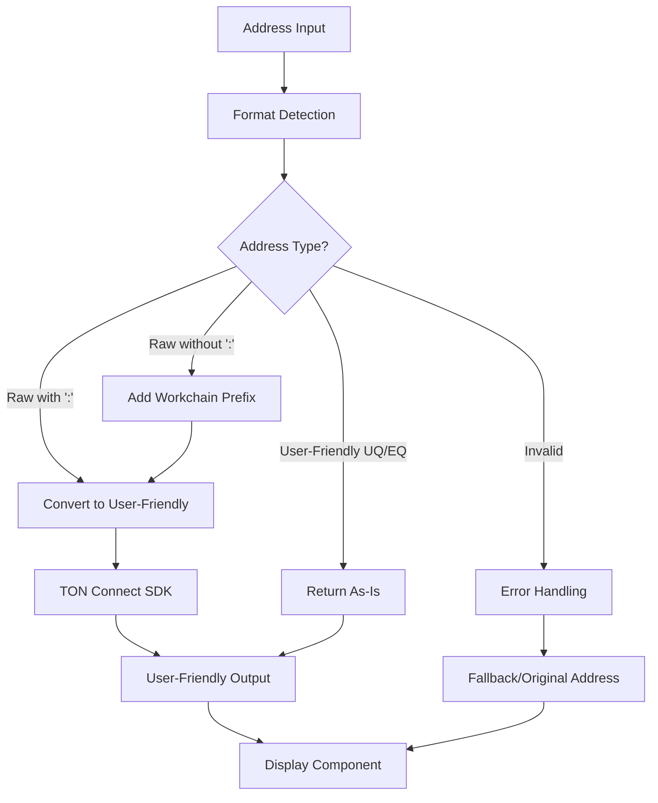

# Design Document: TON Address Formatting Fixes

## Overview

This design addresses critical issues in the TON address formatting utilities by implementing proper address format detection, safe conversion logic, and robust error handling. The solution ensures that user-friendly addresses (UQ/EQ format) are not incorrectly processed through raw address conversion, preventing TON Connect SDK errors.

## Architecture

The fix involves three main architectural layers:

1. **Detection Layer**: Proper identification of address formats (raw vs user-friendly)
2. **Conversion Layer**: Safe address format conversion with fallback handling
3. **Validation Layer**: Comprehensive address validation and error prevention

### Component Architecture



## Components and Interfaces

### Enhanced Address Detection

**Address Format Detection Logic:**
```typescript
interface AddressFormat {
  type: 'user-friendly' | 'raw-with-workchain' | 'raw-without-workchain' | 'invalid';
  isBounceable?: boolean;
  workchain?: number;
  originalFormat: string;
}

function detectAddressFormat(address: string): AddressFormat {
  // User-friendly format detection (UQ/EQ prefix)
  if (/^[UE][QK][A-Za-z0-9_-]{46}$/.test(address)) {
    return {
      type: 'user-friendly',
      isBounceable: address.startsWith('EQ') || address.startsWith('UQ'),
      originalFormat: address
    };
  }
  
  // Raw format with workchain
  if (/^-?[01]:[a-fA-F0-9]{64}$/.test(address)) {
    const [workchain, hash] = address.split(':');
    return {
      type: 'raw-with-workchain',
      workchain: parseInt(workchain),
      originalFormat: address
    };
  }
  
  // Raw format without workchain (48 hex chars)
  if (/^[a-fA-F0-9]{64}$/.test(address)) {
    return {
      type: 'raw-without-workchain',
      workchain: 0, // Default to workchain 0
      originalFormat: address
    };
  }
  
  return { type: 'invalid', originalFormat: address };
}
```

### Safe Conversion System

**Enhanced Conversion Logic:**
```typescript
interface ConversionResult {
  success: boolean;
  address: string;
  error?: string;
  originalFormat: string;
}

function safeToUserFriendlyAddress(address: string): ConversionResult {
  try {
    if (!address) {
      return {
        success: false,
        address: '',
        error: 'Empty address provided',
        originalFormat: address
      };
    }

    const format = detectAddressFormat(address);
    
    switch (format.type) {
      case 'user-friendly':
        // Already in user-friendly format, return as-is
        return {
          success: true,
          address: address,
          originalFormat: address
        };
        
      case 'raw-with-workchain':
        // Convert raw address to user-friendly using TON Connect SDK
        return {
          success: true,
          address: toUserFriendlyAddress(address),
          originalFormat: address
        };
        
      case 'raw-without-workchain':
        // Add workchain prefix and convert
        const rawWithWorkchain = `${format.workchain}:${address}`;
        return {
          success: true,
          address: toUserFriendlyAddress(rawWithWorkchain),
          originalFormat: address
        };
        
      case 'invalid':
        return {
          success: false,
          address: address,
          error: 'Invalid address format',
          originalFormat: address
        };
    }
  } catch (error) {
    return {
      success: false,
      address: address,
      error: error instanceof Error ? error.message : 'Unknown conversion error',
      originalFormat: address
    };
  }
}
```

### Validation System

**Comprehensive Address Validation:**
```typescript
interface ValidationResult {
  isValid: boolean;
  format: AddressFormat;
  errors: string[];
}

function validateTonAddress(address: string): ValidationResult {
  const errors: string[] = [];
  
  if (!address) {
    errors.push('Address is empty or null');
    return {
      isValid: false,
      format: { type: 'invalid', originalFormat: address },
      errors
    };
  }
  
  const format = detectAddressFormat(address);
  
  switch (format.type) {
    case 'user-friendly':
      // Validate base64url encoding and checksum
      if (!isValidBase64Url(address)) {
        errors.push('Invalid base64url encoding');
      }
      break;
      
    case 'raw-with-workchain':
      // Validate workchain and hex format
      if (format.workchain !== 0 && format.workchain !== -1) {
        errors.push('Invalid workchain (must be 0 or -1)');
      }
      break;
      
    case 'raw-without-workchain':
      // Valid by format detection
      break;
      
    case 'invalid':
      errors.push('Address format not recognized');
      break;
  }
  
  return {
    isValid: errors.length === 0,
    format,
    errors
  };
}
```

## Data Models

### Address Processing State

**Processing Context:**
```typescript
interface AddressProcessingContext {
  originalAddress: string;
  detectedFormat: AddressFormat;
  validationResult: ValidationResult;
  conversionResult?: ConversionResult;
  displayAddress: string;
  copyableAddress: string;
}
```

### Error Tracking

**Error Information:**
```typescript
interface AddressError {
  type: 'validation' | 'conversion' | 'display';
  message: string;
  originalAddress: string;
  timestamp: Date;
  context?: Record<string, any>;
}
```

## Error Handling

### Graceful Degradation

**Error Recovery Strategy:**
1. **Format Detection Failure**: Return original address with warning
2. **Conversion Failure**: Fall back to original address, log error
3. **Validation Failure**: Display error state, prevent operations
4. **SDK Errors**: Catch and wrap with context information

**Error Logging:**
```typescript
interface AddressLogger {
  logConversionError(address: string, error: Error): void;
  logValidationWarning(address: string, issues: string[]): void;
  logFormatDetectionIssue(address: string, context: any): void;
}
```

### User Experience Errors

**Component Error States:**
- **Invalid Address**: Show clear error message with format examples
- **Conversion Failed**: Display original address with warning icon
- **Network Issues**: Provide retry mechanism for SDK operations
- **Clipboard Errors**: Fallback to manual selection for copying

## Testing Strategy

### Unit Testing Approach

**Address Format Detection:**
- Test all valid user-friendly formats (UQ, EQ, UK, EK prefixes)
- Test raw addresses with and without workchain
- Test invalid formats and edge cases
- Test empty, null, and malformed inputs

**Conversion Logic:**
- Test user-friendly to user-friendly (should be no-op)
- Test raw to user-friendly conversion
- Test error handling for invalid inputs
- Test TON Connect SDK integration

### Integration Testing

**Component Integration:**
- Test SettingsComponent with various address formats
- Test address copying functionality
- Test error display and recovery
- Test real wallet connection scenarios

**Performance Testing:**
- Test address processing speed with large datasets
- Test memory usage with repeated conversions
- Test caching effectiveness for repeated operations

## Correctness Properties

*A property is a characteristic or behavior that should hold true across all valid executions of a system-essentially, a formal statement about what the system should do. Properties serve as the bridge between human-readable specifications and machine-verifiable correctness guarantees.*

### Property Analysis

After analyzing the acceptance criteria, I've identified several properties that can be combined:

- Properties 2.1 and 2.2 both relate to conversion behavior and can be unified
- Properties 3.1, 3.2, and 3.4 all relate to validation and can be combined
- Properties 4.1, 4.2, and 4.3 all relate to component integration and can be unified
- Properties 5.1, 5.2, and 5.4 all relate to error handling and can be combined

### Core Properties

**Property 1: Address Format Detection Accuracy**
*For any* valid TON address string, the format detection should correctly identify whether it's user-friendly (UQ/EQ), raw with workchain, or raw without workchain
**Validates: Requirements 1.1, 1.2, 1.3, 1.4**

**Property 2: Safe Conversion Behavior**
*For any* address input, conversion to user-friendly format should either return a valid user-friendly address or the original address with error information, never throwing unhandled exceptions
**Validates: Requirements 2.1, 2.2, 2.4**

**Property 3: Validation Consistency**
*For any* address validation, the result should be deterministic and provide clear boolean results with detailed error information when validation fails
**Validates: Requirements 3.1, 3.2, 3.3, 3.4**

**Property 4: Component Integration Reliability**
*For any* address displayed in components, the formatting should work correctly and provide appropriate fallback behavior when errors occur
**Validates: Requirements 4.1, 4.2, 4.3, 4.5**

**Property 5: Error Handling Robustness**
*For any* error condition in address processing, the system should log appropriate information, continue functioning, and provide meaningful feedback without exposing sensitive data
**Validates: Requirements 5.1, 5.2, 5.4**

**Property 6: Performance Efficiency**
*For any* address that is already in the target format, the system should return it immediately without unnecessary processing or conversion attempts
**Validates: Requirements 6.1, 6.2, 6.3**

**Property 7: Backward Compatibility**
*For any* existing component using address utilities, the updated functions should maintain the same interface and not break existing functionality
**Validates: Requirements 7.1, 7.2, 7.3, 7.5**

**Property 8: User-Friendly Address Preservation**
*For any* address that starts with UQ or EQ prefix, attempting to convert it to user-friendly format should return the same address unchanged
**Validates: Requirements 2.1**

**Property 9: Raw Address Conversion**
*For any* valid raw address (with or without workchain), conversion to user-friendly format should produce a valid UQ/EQ prefixed address
**Validates: Requirements 2.2**

**Property 10: Input Validation Safety**
*For any* null, undefined, empty, or malformed address input, the validation and conversion functions should handle them gracefully without crashing
**Validates: Requirements 2.3, 3.3, 5.4**