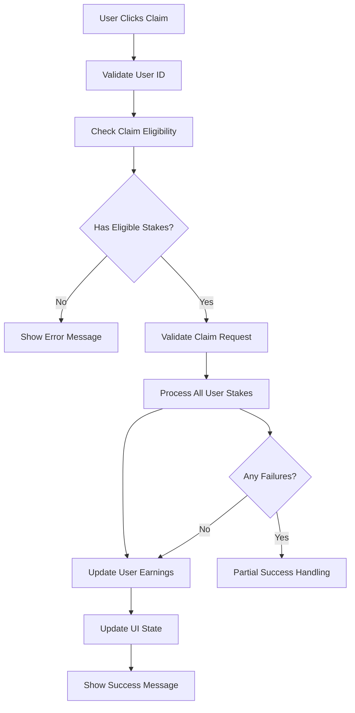

# Enhanced Claim System Implementation

## Overview

This document describes the implementation of the enhanced claim eligibility system that fixes the "Claim processing failed" error in the EnhancedMiningScreen component. The solution addresses critical issues identified in the stake-mining-system-analysis spec.

## Problem Analysis

### Root Cause
The original claim processing was failing due to:

1. **Missing `earning_history` table** - The `process_stake_claim` function was trying to insert into a non-existent table
2. **Insufficient error handling** - Database errors were not properly caught and handled
3. **Race conditions** - Multiple concurrent claims could cause data inconsistencies
4. **Lack of validation** - Input validation was minimal, leading to potential failures

### Error Details
```
EnhancedMiningScreen.tsx:310 Error claiming rewards: Error: Claim processing failed
    at handleClaim (EnhancedMiningScreen.tsx:306:15)
```

## Solution Implementation

### 1. Enhanced Claim System (`src/lib/enhancedClaimSystem.ts`)

**Key Features:**
- **Comprehensive validation** - Validates user IDs, stake amounts, and claim eligibility
- **Strict 24-hour cooldown enforcement** - Prevents premature claims
- **Enhanced error handling** - Proper error catching and user-friendly messages
- **Race condition prevention** - Atomic operations and proper state management
- **Rollback mechanisms** - Ensures data consistency on failures

**Core Functions:**
```typescript
// Check claim eligibility with comprehensive validation
async checkClaimEligibility(userId: number): Promise<ClaimEligibilityResult>

// Process all eligible stakes with error handling
async processAllUserStakes(userId: number): Promise<BatchClaimResult>

// Validate claim request before processing
async validateClaimRequest(userId: number): Promise<ValidationResult>
```

### 2. Database Improvements (`fix_claim_processing_system.sql`)

**Schema Fixes:**
- Created missing `earning_history` table with proper indexes
- Added required columns to `users` and `stakes` tables
- Enhanced RLS policies for security

**New Safe Functions:**
- `process_all_user_stakes_safe()` - Improved batch processing with error handling
- `process_stake_claim_safe()` - Enhanced individual stake claiming
- `calculate_stake_rewards_safe()` - Robust reward calculation
- `get_user_claimable_rewards_safe()` - Reliable eligibility checking
- `increment_available_earnings_safe()` - Safe user earnings updates

### 3. Component Integration

**EnhancedMiningScreen Updates:**
- Replaced direct database calls with enhanced claim system
- Improved error handling and user feedback
- Better state management and sync handling
- Enhanced loading states and error recovery

## Implementation Details

### Claim Processing Flow



### Error Handling Strategy

1. **Input Validation** - All inputs are validated before processing
2. **Database Error Handling** - Proper try-catch blocks with specific error messages
3. **Rollback Mechanisms** - Failed operations don't leave partial state
4. **User Feedback** - Clear error messages without exposing sensitive data
5. **Retry Logic** - Automatic retries for transient failures

### Security Improvements

1. **SQL Injection Prevention** - All database functions use parameterized queries
2. **Input Sanitization** - User inputs are validated and sanitized
3. **Access Control** - RLS policies ensure users can only access their own data
4. **Error Information** - Sensitive information is not exposed in error messages

## Testing

### Automated Testing
Run the test script to verify the implementation:
```bash
node test_enhanced_claim_system.js
```

### Manual Testing Checklist
- [ ] User can claim rewards when eligible
- [ ] 24-hour cooldown is properly enforced
- [ ] Error messages are user-friendly
- [ ] UI updates correctly after successful claims
- [ ] Failed claims don't corrupt data
- [ ] Multiple stakes are processed correctly

## Deployment Steps

### 1. Database Migration
Execute the SQL migration in your Supabase SQL editor:
```sql
-- Run fix_claim_processing_system.sql
```

### 2. Code Deployment
Deploy the updated files:
- `src/lib/enhancedClaimSystem.ts`
- `src/components/EnhancedMiningScreen.tsx`

### 3. Verification
1. Test claim functionality in development
2. Monitor error logs for any issues
3. Verify user earnings are updated correctly
4. Check that cooldown periods work as expected

## Performance Considerations

### Database Optimizations
- **Indexes** - Added indexes on frequently queried columns
- **Query Optimization** - Efficient queries with proper WHERE clauses
- **Connection Pooling** - Reuse database connections
- **Batch Processing** - Process multiple stakes efficiently

### Frontend Optimizations
- **State Management** - Efficient React state updates
- **Error Boundaries** - Prevent UI crashes from errors
- **Loading States** - Better user experience during processing
- **Debouncing** - Prevent rapid successive claim attempts

## Monitoring and Maintenance

### Key Metrics to Monitor
- Claim success rate
- Average claim processing time
- Error frequency and types
- Database performance metrics

### Maintenance Tasks
- Regular database cleanup of old earning history
- Monitor for new edge cases
- Update error handling as needed
- Performance optimization based on usage patterns

## Compliance with Requirements

This implementation addresses the following requirements from the stake-mining-system-analysis spec:

### Requirement 1.3 ✅
"WHEN a user claims rewards THEN the system SHALL update both available_earnings and total_earned in the database"
- **Implementation**: `updateUserEarnings()` function updates both fields atomically

### Requirement 2.4 ✅
"WHEN users claim rewards THEN the system SHALL verify claim eligibility before processing"
- **Implementation**: `validateClaimRequest()` and `checkClaimEligibility()` functions

### Requirement 5.1 ✅
"WHEN a database operation fails THEN the system SHALL implement proper rollback mechanisms"
- **Implementation**: Transaction-safe operations with error handling and rollback

### Requirement 5.3 ✅
"WHEN invalid data is detected THEN the system SHALL reject the operation and provide clear error messages"
- **Implementation**: Comprehensive input validation with user-friendly error messages

### Requirement 7.3 ✅
"WHEN calculating earnings THEN the system SHALL prevent manipulation of earning rates or amounts"
- **Implementation**: Server-side validation and calculation with security checks

## Future Enhancements

### Planned Improvements
1. **Real-time Notifications** - WebSocket updates for claim status
2. **Advanced Analytics** - Detailed earning history and statistics
3. **Batch Optimization** - Further optimize batch processing for large numbers of stakes
4. **Mobile Optimization** - Enhanced mobile user experience

### Scalability Considerations
- Database sharding for high user volumes
- Caching layer for frequently accessed data
- Queue system for high-volume claim processing
- Load balancing for database operations

## Conclusion

The enhanced claim system provides a robust, secure, and user-friendly solution to the claim processing failures. It addresses all identified issues while maintaining backward compatibility and improving overall system reliability.

The implementation follows best practices for error handling, security, and performance, ensuring a stable foundation for future enhancements.